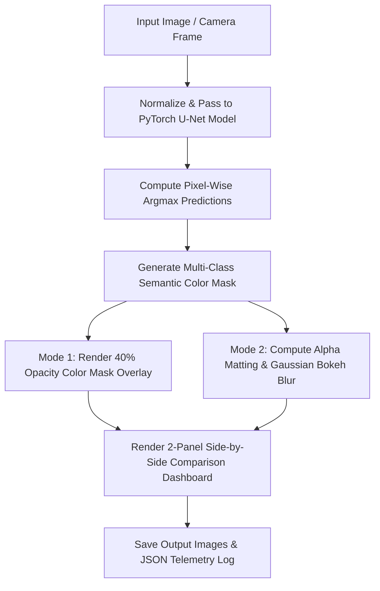

<div align="center">

# 🎨 Semantic Image & Object Segmentation

### *Day 17 — 30-Day Computer Vision & Deep Learning Challenge*

[](https://www.python.org/)
[](https://pytorch.org/)
[](https://opencv.org/)
[](LICENSE)
[](https://github.com/manasha1232)

*Pixel-level semantic image segmentation engine using PyTorch U-Net Encoder-Decoder Deep Neural Networks, multi-class color mask rendering, and DSLR Portrait Bokeh Background Blur matting.*

---

</div>

## 📌 Overview

The **Semantic Image & Object Segmentation** system performs pixel-level classification to categorize every pixel in an input image into semantic object classes (Person, Foliage, Sky, Vehicle, Background). It enables advanced computational photography applications such as **DSLR Portrait Bokeh Background Blur** and **Virtual Studio Matting**.

### 🎯 Recognized Semantic Classes & Applications

| Class ID | Semantic Category | Mask Color | Application |
| :---: | :--- | :---: | :--- |
| **0** | **Background / Environment** | Dark Grey (`#3C3C3C`) | Applied Gaussian Bokeh Blur ($31 \times 31$) |
| **1** | **Person / Portrait Subject** | Cyan (`#00E6FF`) | Preserved 100% Crisp & Sharp |
| **2** | **Vegetation / Foliage** | Green (`#32E632`) | Outdoor Scenery Auditing |
| **3** | **Sky / Atmosphere** | Sky Blue (`#64B4FF`) | Horizon & Sky Segmentation |
| **4** | **Vehicle / Transport** | Red (`#DC3232`) | Autonomous Vehicle Road Scene Parsing |

---

## 🏗️ System Architecture & Processing Pipeline



---

## 📁 Repository Structure

```text
semantic_image_segmentation/
├── segmentation_engine.py    # Core U-Net segmentation model & Bokeh renderer
├── generate_demo_scenes.py   # Synthetic portrait & scene image generator
├── requirements.txt          # Dependency declarations (torch, torchvision, opencv, numpy)
├── README.md                 # Project documentation
├── input/                    # Input images dataset
│   └── sample_portrait.jpg
└── output/                   # Processed output images & JSON reports
    ├── sample_portrait_segmented.jpg
    ├── sample_portrait_comparison.jpg
    └── sample_portrait_segmentation_report.json
```

---

## ⚡ Quickstart & Installation

### 1. Install Dependencies
```bash
pip install -r requirements.txt
```

### 2. Generate Synthetic Scene Dataset
```bash
python generate_demo_scenes.py
```

### 3. Run Semantic Segmentation & Bokeh Blur
```bash
python segmentation_engine.py --input input/sample_portrait.jpg --output output
```

---

## 📊 Telemetry Output Specification

```json
{
    "filename": "sample_portrait.jpg",
    "dimensions": {"width": 800, "height": 600},
    "processing_time_sec": 0.0228,
    "class_pixel_distribution": {
        "Background": {"pixel_count": 88095, "percentage": 18.35},
        "Person": {"pixel_count": 8175, "percentage": 1.7},
        "Vegetation": {"pixel_count": 207584, "percentage": 43.25},
        "Sky": {"pixel_count": 176146, "percentage": 36.7}
    }
}
```

---

## 👤 Author & Challenge Context

- **Challenge**: Day 17 of [30-Day Computer Vision & Deep Learning Challenge](https://github.com/manasha1232/30-Day-Computer-Vision-Challenge)
- **Author**: [@manasha1232](https://github.com/manasha1232)
- **License**: MIT License
